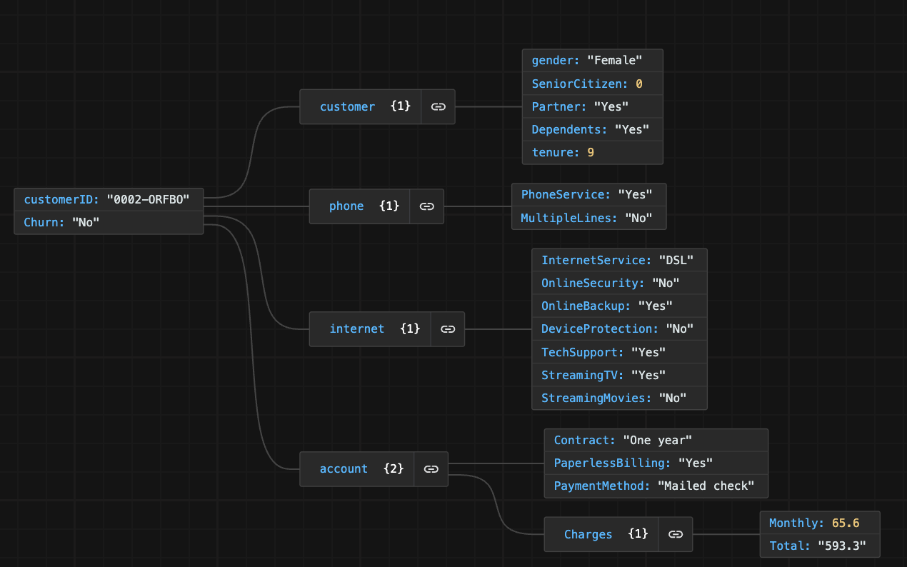

# Challenge Telecom X - Análisis de Evasión de Clientes

## Descripción

Este proyecto aborda el análisis de datos de clientes de la empresa Telecom X, con el objetivo principal de identificar los factores que influyen en la evasión o abandono de clientes (churn). A través de la limpieza, transformación y análisis exploratorio de los datos, se busca generar insights y recomendaciones estratégicas para mejorar la retención y optimizar los servicios ofrecidos por la compañía.

## Estructura del proyecto

- **TelecomX_LATAM.ipynb**: Notebook principal con todo el proceso de análisis, desde la carga y limpieza de datos hasta la visualización y conclusiones.
- **TElco-Customer-Churn.json**: Fuente de datos
- **README.md**: Este archivo, con la descripción general del proyecto.

### Diccionario de Datos

#### Telco-Customer-Churn.json
* customerID: número de identificación único de cada cliente
* Churn: si el cliente dejó o no la empresa

* gender: género (masculino y femenino)
* SeniorCitizen: información sobre si un cliente tiene o no una edad igual o mayor a 65 años
* Partner: si el cliente tiene o no una pareja
* Dependents: si el cliente tiene o no dependientes
* tenure: meses de contrato del cliente

* PhoneService: suscripción al servicio telefónico
* MultipleLines: suscripción a más de una línea telefónica

* InternetService: suscripción a un proveedor de internet
* OnlineSecurity: suscripción adicional de seguridad en línea
* OnlineBackup: suscripción adicional de respaldo en línea
* DeviceProtection: suscripción adicional de protección del dispositivo
* TechSupport: suscripción adicional de soporte técnico, menor tiempo de espera
* StreamingTV: suscripción de televisión por cable
* StreamingMovies: suscripción de streaming de películas

* Contract: tipo de contrato
* PaperlessBilling: si el cliente prefiere recibir la factura en línea
* PaymentMethod: forma de pago

* Charges.Monthly: total de todos los servicios del cliente por mes
* Charges.Total: total gastado por el cliente

#### Vista del JSON

## Pasos principales del análisis

1. **Extracción y carga de datos**: Se importan los datos desde una fuente externa en formato JSON.
2. **Limpieza y transformación**: 
   - Normalización de columnas anidadas.
   - Conversión de tipos de datos.
   - Eliminación de registros vacíos o duplicados.
   - Creación y renombrado de variables relevantes.
3. **Análisis exploratorio**:
   - Estadísticas descriptivas.
   - Visualización de la distribución de variables clave.
   - Análisis de correlación entre variables.
   - Segmentación de clientes según servicios, tipo de contrato, método de pago, etc.
4. **Conclusiones e insights**: 
   - Identificación de los principales factores asociados al abandono.
   - Recomendaciones estratégicas para reducir la tasa de churn.

## Principales hallazgos

- La tasa de abandono es aproximadamente del 26.5%.
- Los clientes con contratos mensuales, menos servicios contratados o que pagan por cheque electrónico presentan mayor propensión a abandonar.
- La fidelización mejora con el tiempo y con la contratación de múltiples servicios.
- El servicio de fibra óptica muestra una tasa de abandono superior, lo que sugiere oportunidades de mejora en la experiencia del cliente.

## Recomendaciones

- Incentivar la contratación de múltiples servicios y contratos de mayor duración.
- Promover métodos de pago automáticos.
- Mejorar la calidad del servicio de fibra óptica.
- Desarrollar estrategias de retención específicas para clientes nuevos.

## Requisitos

- Python 3.x
- Pandas
- Matplotlib
- Seaborn
- Jupyter Notebook

## Uso

1. Clona este repositorio.
2. Abre el archivo `TelecomX_LATAM.ipynb` en Jupyter Notebook o Google Colab.
3. Ejecuta las celdas para reproducir el análisis y visualizar los resultados.

---

**Autor:** Ana Sayago  
**Desafío:** Alura Latam - Oracle Next Education  

